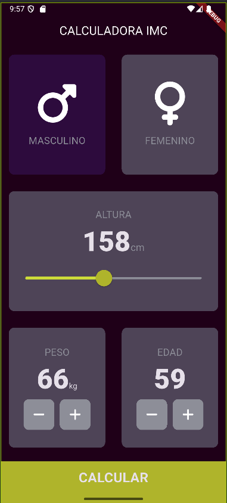
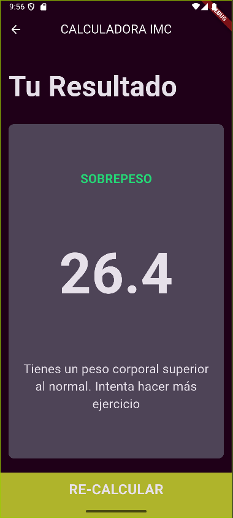

# 🧮 Calculadora IMC Flutter

## 📋 Descripción general
Esta aplicación móvil desarrollada en Flutter permite calcular el Índice de Masa Corporal (IMC) de un usuario ingresando su género, altura, peso y edad. El proyecto está diseñado con una interfaz intuitiva y atractiva, usando widgets personalizados para mejorar la experiencia de usuario. La app muestra el resultado del IMC junto con una interpretación y recomendaciones basadas en el valor calculado.

---

## 👁️ Vista App
<p align="center">
  
  
</p>

---

## 🚀 Funcionalidades principales
- Selección del género (masculino o femenino).
- Ajuste de la altura mediante un slider interactivo.
- Incremento o decremento del peso y la edad con botones personalizados.
- Cálculo del IMC.
- Pantalla de resultados que muestra:
    - Valor numérico del IMC.
    - Clasificación del IMC (por ejemplo: Bajo peso, Normal, Sobrepeso, Obesidad).
    - Interpretación y recomendaciones personalizadas.
- Navegación sencilla entre la pantalla de entrada y la de resultados.
- Diseño responsivo y reutilización de componentes mediante widgets personalizados.

---

## ⚙️ Requisitos del proyecto
- **Flutter SDK**: [Instalar Flutter](https://flutter.dev/docs/get-started/install)
- **Android Studio** o **Visual Studio Code**: Recomendado para desarrollar y ejecutar la aplicación en un emulador o dispositivo real.

---

## 🧰 Tecnologías y paquetes externos utilizados
- **Flutter**: Framework para desarrollo multiplataforma de aplicaciones móviles.
- **Dart**: Lenguaje de programación utilizado.
- **font_awesome_flutter**: Paquete para iconos adicionales FontAwesome.
- Widgets personalizados creados:
    - `Reusablecard` (tarjetas reutilizables)
    - `IconContent` (íconos con etiquetas)
    - `RoundIconButton` (botones redondos con iconos)
    - `BottomButton` (botón inferior principal)

---

## 🗂️ Estructura del proyecto
```
lib/
│
├── components/ # Widgets reutilizables
│ ├── reusable_card.dart
│ ├── icon_content.dart
│ ├── round_icon_button.dart
│ └── buttom_button.dart
│
├── screens/ # Pantallas principales
│ ├── input_page.dart # Pantalla para ingresar datos
│ └── results_page.dart # Pantalla para mostrar resultados
│
├── calculator_brain.dart # Lógica para calcular IMC e interpretaciones
├── constants.dart # Constantes de estilos y colores
└── main.dart # Punto de entrada de la app
```
---

## 👤 Autor

Desarrollado por **María José Mendieta Ortiz**   
🌐 https://github.com/MariaJoseMendieta
